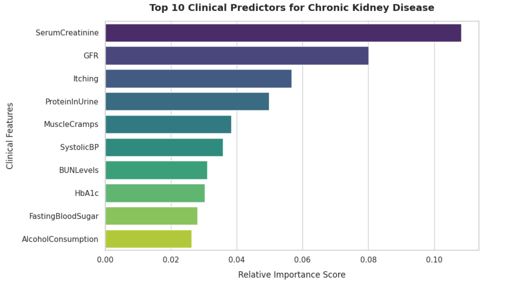

# Chronic Kidney Disease Prediction via Soft-Voting Ensemble Infrastructure

This repository hosts an advanced machine learning framework designed to predict the risk of Chronic Kidney Disease (CKD) using multi-parametric clinical indicators. By combining heterogeneous classification networks through an ensemble layer, the system achieves robust generalization performance on clinical data characterized by structural target class imbalances.

## 📌 Project Overview & Pipeline Architectural Blueprint
Medical screening infrastructure requires high statistical sensitivity to minimize clinical false-negative omissions. This project optimizes a complete data pipeline ranging from multivariate data cleaning to composite predictive mapping.

1. **Ingestion & Feature Inspection**: Loads demographic and clinical profiles (54 indicators across 1,659 unique cases).
2. **Advanced Imputation Pipeline**: Deploys a Multivariate Imputation by Chained Equations (MICE) protocol via `IterativeImputer` to secure missing feature spaces dynamically without inducing statistical variance bias.
3. **Feature Scaling**: Normalizes variable dimensions globally using a `StandardScaler` to protect estimator gradients.
4. **Stratified Partitioning**: Enforces cross-validation stability by preserving target class density across 80/20 train-test matrices.
5. **Ensemble Architecture**: Deploys a soft-voting ensemble comprising:
   - **Random Forest Classifier**: Handles highly non-linear feature constraints.
   - **XGBoost Classifier**: Implements regularized gradient boosting to eliminate variance over-fitting.
   - **Logistic Regression**: Serves as a high-fidelity continuous probabilistic baseline.

## 🛠️ Technology Stack & Dependencies
- **Execution Engine**: Python 3.x / Google Colab Architecture
- **Core Engineering Platforms**: `Pandas`, `NumPy`
- **Algorithmic Toolkits**: `Scikit-learn (Sklearn)`, `XGBoost`
- **Visualization Engines**: `Matplotlib`, `Seaborn`

## 📊 Performance & Evaluation
The model is benchmarked comprehensively using strict clinical evaluation criteria: Accuracy, Precision, Recall, and the Macro F1-Score. The underlying soft-voting mechanics aggregate continuous array probability vectors, maximizing predictive coverage over the minority class (No Disease).



## 💻 How To Run the Infrastructure Locally
1. Clone this repository directly onto your system setup:
   ```bash
   git clone [https://github.com/YOUR_GITHUB_USERNAME/chronic-kidney-disease-ensemble-prediction.git](https://github.com/YOUR_GITHUB_USERNAME/chronic-kidney-disease-ensemble-prediction.git)
